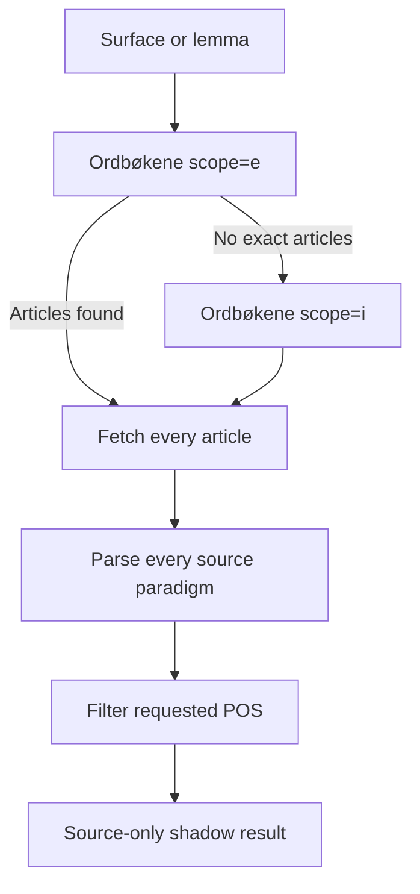
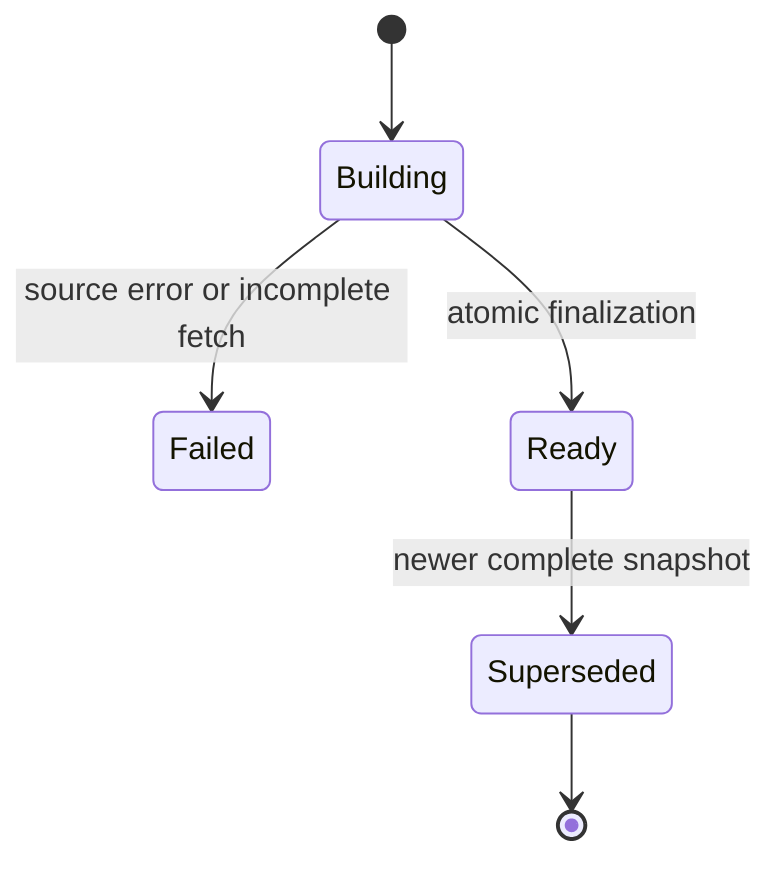

# D10 — Authoritative Morphology V2

## Status

Source parsing, production hardening, and cutover controls are complete.
The reviewed database contract is staged as
`supabase/migrations/20260902083000_authoritative_morphology_v2.sql` with its
pgTAP suite under `supabase/tests/`.

This package is intentionally **not deployed or applied**. The pending copies
remain as review provenance until the versioned migration passes dry-run and
the production rollout reaches the schema gate.

## Goal

Make Ordbøkene the only producer of Norwegian word forms. AI may explain or
translate an already sourced form, but it may not invent, complete, rank, or
repair a paradigm.

The source contract is based on the official UiB API documentation:

- `scope=e` returns exact lemma articles;
- `scope=i` resolves inflected surface forms;
- article JSON is fetched from `/{dictionary}/article/{article_id}.json`;
- the official data export states that one word may map to several articles,
  and one article may expose several paradigms.

References:

- https://ord.uib.no/ord_2_API.html
- https://ord.uib.no/ord_1_Ordlister.html
- https://ordbokene.no/bm%2Cnn/f%C3%A5

## Isolation boundary

The following production behavior remains unchanged until flags are enabled:

- `supabase/functions/forms-enrichment-worker/index.ts`;
- `forms-enrichment-worker` remains the completion-accounted producer;
- `job-enrichment-batch-worker` calls V2 only with
  `D10_FORMS_V2_SHADOW_ENABLED=true`;
- V2 persistence additionally requires `D10_FORMS_V2_PERSIST_ENABLED=true`;
- the application remains on legacy unless
  `EXPO_PUBLIC_FORMS_READ_MODEL=v2`;
- text analysis remains on legacy unless `D10_FORMS_READ_MODEL=v2`;
- Grammar KB, its graph, compiler, runtime release, and phase routing;
- all production functions and database objects.

No request combines legacy and V2 rows. A V2 read failure returns no forms for
that read; it never silently falls back to legacy.

### Relationship to existing Morphological Disambiguation V1

The repository already contains the applied/staged grammar-side migrations
`20260830192313`, `20260830192415`, and `20260830192639`. They resolve competing
token readings inside the structural language graph and publish
`morphology_v1`; they do not authoritatively fetch or store Ordbøkene form
paradigms.

D10 is an upstream lexical-source contract. It must eventually provide
source-backed candidate readings to that resolver, not replace its structural
agreement/evidence logic. No v1 migration or runtime release is changed here.

## Source resolution



There is no `slice(0, 5)` or equivalent cap. A partial article-fetch failure is
reported explicitly; it cannot silently produce a complete snapshot.

## Canonical identity

A paradigm identity is:

```text
dictionary_code | article_id | POS | paradigm_id
```

Every component is URL-encoded before concatenation. Lemma text is descriptive,
not identity.

This prevents homonym and paradigm collapse:

| Lemma | Dictionary | Article | POS | Paradigm |
| --- | --- | ---: | --- | ---: |
| `få` | BM | 18820 | verb | 195 |
| `få` | BM | 18819 | determiner | 427 |
| `få` | NN | 23680 | verb | 1508 |
| `få` | NN | 23679 | adjective | 2130 / 2132 |

An article with several official paradigms also stays split. BM article 19072
for `gape` contains paradigm 1 (`gapa`) and paradigm 16 (`gapte`).

## Form rules

The parser stores only non-empty `word_form` values present in source JSON.
For every form it preserves:

- source value and normalized value;
- exact Ordbøkene tags;
- deterministic `form_key` derived from the tags;
- source ordinal inside the paradigm;
- dictionary, article, POS, paradigm, version, and URL provenance.

It does not create:

- `har <participle>` or `hadde <participle>`;
- `needs_review` rows;
- guessed lemmas or forms;
- AI-synthesized alternatives;
- an implicit primary/alternative rank based on response order.

All official variants survive unchanged. In the current golden data this
includes `gapa`/`gapte` and `håpa`/`håpet`/`håpte`. The source layer does not
reinterpret `-a`, `-et`, `-te`, `sa`, or `la`.

`BokmalWrittenFormSelectionPolicy` is a separate display contract. For a
Bokmål verb group where official written non-`-a` variants coexist, it keeps
the `-et`/`-te` values in the ordered primary array and the official `-a`
value in the alternative array. If only `-a` exists, it stays primary. The
short irregular forms `sa` and `la` are never classified by suffix alone.

Evidence is explicit: Ordbøkene supplies every value; Språkrådet's 2025-05-07
guidance documents register tendencies for Bokmål `-a` endings; and the app's
moderate-written default is a versioned product policy, not a claim that an
official alternative is incorrect.

## Pedagogical preference and irregularity

Source truth and product presentation are separate contracts.

`FormPreferenceProvider` may later annotate a complete source paradigm with:

- `regular`, `irregular`, `suppletive`, or `unknown`;
- preferred form keys;
- usage notes and evidence IDs.

The provider cannot add, delete, or rewrite source forms. The default provider
returns no preference and therefore leaves regularity `unknown`. This avoids
misclassifying examples such as `få`, whose current API payload uses the raw
group label `VERB_regular` despite its suppletive forms.

The application can eventually use a confirmed marker to style irregular
verbs (for example, red text in cards), but it must not turn `unknown` into
`irregular`.

## Grammar KB integration gate

The current Grammar KB and language graph are under active development. D10
therefore depends only on the `FormPreferenceProvider` interface.

After D09 closes, integration must start by re-reading the then-current:

- NRG source graph;
- runtime manifest / IR and compiler;
- versioned Grammar Runtime Release;
- rule triggers, operators, conflicts, evidence, provenance, and trace;
- database grammar rules that describe written preference and spoken/rare
  variants.

Only a versioned, evidence-bearing runtime rule may supply a preference or
irregularity marker. Grammar rules may affect presentation and teaching, never
the presence of source forms in the canonical morphology snapshot.

## Shadow function

`forms-enrichment-v2-shadow`:

- is explicitly configured with `verify_jwt = false` because modern
  `sb_secret_` keys are not JWTs;
- authenticates inside the handler through `@supabase/server` with the named
  `secret:completionshadow` key supplied only in the `apikey` header;
- has a DPAPI-aware operator runner at
  `scripts/run-d10-morphology-shadow.ps1`; the decrypted key exists only in
  the PowerShell process and is never written or printed;
- accepts `query`, optional `pos`, and optional `dictionaries`;
- fetches Ordbøkene live and returns parsed paradigms;
- always reports `mode=shadow`, `sourceOnly=true`, and `persisted=false`;
- has no Supabase client and performs no database writes.

## Versioned storage contract

`supabase/migrations/20260902083000_authoritative_morphology_v2.sql` defines four
private source/audit tables and one public read projection:

1. immutable lookup snapshots;
2. source paradigms inside a snapshot;
3. exact forms inside a paradigm;
4. bounded V1/V2 comparison evidence;
5. `public.lexeme_form_display_v2`, containing ordered primary and alternative
   arrays for authenticated application reads.

RLS is enabled and forced. `anon` cannot read the projection; authenticated
users can only select it. Private tables have no direct client or service-role
grants. The guarded publisher RPC is service-role-only. Every foreign-key
column has an index.

Snapshot construction and publication are separate:



The finalizer rejects snapshots when:

- any source fetch failed;
- fetched article count differs from the expected count;
- there are no paradigms;
- any paradigm has no forms.

The publisher takes a per-lexeme transaction advisory lock and atomically
switches the active snapshot together with the canonical projection; therefore
stale paradigms from the previous release cannot remain visible.

## Golden corpus

Fixtures were refreshed from the live official JSON on 2026-09-01:

- `få`: BM verb + determiner; NN verb + adjective;
- `gape`, BM article 19072: paradigms 1 and 16 preserve `gapa` and `gapte`;
- `håpe`, BM article 25496: paradigms preserve `håpa`, `håpet`, `håpte`.

Tests are offline and deterministic; live-source drift is a separate shadow
observation, not a reason to make unit tests depend on the network.

## Safe cutover order

1. Make Local/Remote migration history identical without repair, deletion,
   renaming, or overwriting old migrations. Completed on 2026-09-02.
2. Create and review the versioned migration. Completed as
   `20260902083000_authoritative_morphology_v2.sql`.
3. Run dry-run, validate the versioned pgTAP suite, and apply only after both
   checks pass.
4. Deploy the JWT-protected V2 worker, keeping both D10 flags false.
5. Enable backend shadow only for explicit job UUIDs with
   `D10_FORMS_V2_SHADOW_ENABLED=true` and
   `D10_FORMS_V2_CANARY_JOB_IDS=<comma-separated UUIDs>`, then compare V1/V2
   coverage and errors. A missing, malformed, empty, or larger-than-500
   allowlist fails closed.
6. Enable V2 persistence while the app still reads legacy; verify atomic
   replacement and bounded storage.
7. Switch app and text analysis to V2, then convert all remaining readers.
8. Remove bridges and legacy tables only after the dependency audit returns
   zero, in a separate approved destructive migration.

No full refresh or lexical rerun belongs to this package.
