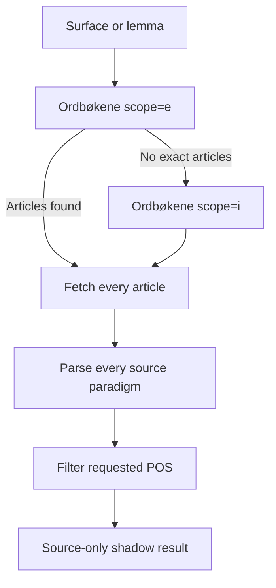
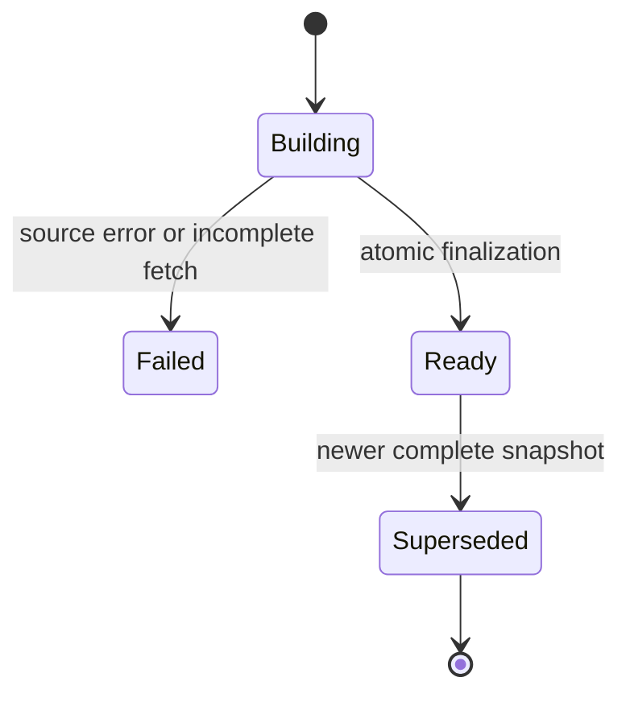

# D10 — Authoritative Morphology V2 (source-only)

## Status

Recovered implementation, isolated on `d10/source-only-recovery`.

This package is intentionally **not deployed** and **not connected** to the
current enrichment or text-analysis pipeline. Its SQL remains under
`supabase/pending/`; no D10 file exists under `supabase/migrations/`.

## Goal

Make Ordbøkene the only producer of Norwegian word forms. AI may explain or
translate an already sourced form, but it may not invent, complete, rank, or
repair a paradigm.

The source contract is based on the official UiB API documentation:

- `scope=e` returns exact lemma articles;
- `scope=i` resolves inflected surface forms;
- article JSON is fetched from `/{dictionary}/article/{article_id}.json`;
- the official data export states that one word may map to several articles,
  and one article may expose several paradigms.

References:

- https://ord.uib.no/ord_2_API.html
- https://ord.uib.no/ord_1_Ordlister.html
- https://ordbokene.no/bm%2Cnn/f%C3%A5

## Isolation boundary

The following existing components are unchanged:

- `supabase/functions/forms-enrichment-worker/index.ts`;
- `job-enrichment-batch-worker` and every caller of the current forms worker;
- application reads from `lexeme_form_variants`;
- Grammar KB, its graph, compiler, runtime release, and phase routing;
- all production functions and database objects.

The new code is reachable only through an explicitly invoked shadow endpoint.
The endpoint performs no database writes.

### Relationship to existing Morphological Disambiguation V1

The repository already contains the applied/staged grammar-side migrations
`20260830192313`, `20260830192415`, and `20260830192639`. They resolve competing
token readings inside the structural language graph and publish
`morphology_v1`; they do not authoritatively fetch or store Ordbøkene form
paradigms.

D10 is an upstream lexical-source contract. It must eventually provide
source-backed candidate readings to that resolver, not replace its structural
agreement/evidence logic. No v1 migration or runtime release is changed here.

## Source resolution



There is no `slice(0, 5)` or equivalent cap. A partial article-fetch failure is
reported explicitly; it cannot silently produce a complete snapshot.

## Canonical identity

A paradigm identity is:

```text
dictionary_code | article_id | POS | paradigm_id
```

Every component is URL-encoded before concatenation. Lemma text is descriptive,
not identity.

This prevents homonym and paradigm collapse:

| Lemma | Dictionary | Article | POS | Paradigm |
| --- | --- | ---: | --- | ---: |
| `få` | BM | 18820 | verb | 195 |
| `få` | BM | 18819 | determiner | 427 |
| `få` | NN | 23680 | verb | 1508 |
| `få` | NN | 23679 | adjective | 2130 / 2132 |

An article with several official paradigms also stays split. BM article 19072
for `gape` contains paradigm 1 (`gapa`) and paradigm 16 (`gapte`).

## Form rules

The parser stores only non-empty `word_form` values present in source JSON.
For every form it preserves:

- source value and normalized value;
- exact Ordbøkene tags;
- deterministic `form_key` derived from the tags;
- source ordinal inside the paradigm;
- dictionary, article, POS, paradigm, version, and URL provenance.

It does not create:

- `har <participle>` or `hadde <participle>`;
- `needs_review` rows;
- guessed lemmas or forms;
- AI-synthesized alternatives;
- an implicit primary/alternative rank based on response order.

All official variants survive unchanged. In the current golden data this
includes `gapa`/`gapte` and `håpa`/`håpet`/`håpte`. The source layer does not
reinterpret `-a`, `-et`, `-te`, `sa`, or `la`.

## Pedagogical preference and irregularity

Source truth and product presentation are separate contracts.

`FormPreferenceProvider` may later annotate a complete source paradigm with:

- `regular`, `irregular`, `suppletive`, or `unknown`;
- preferred form keys;
- usage notes and evidence IDs.

The provider cannot add, delete, or rewrite source forms. The default provider
returns no preference and therefore leaves regularity `unknown`. This avoids
misclassifying examples such as `få`, whose current API payload uses the raw
group label `VERB_regular` despite its suppletive forms.

The application can eventually use a confirmed marker to style irregular
verbs (for example, red text in cards), but it must not turn `unknown` into
`irregular`.

## Grammar KB integration gate

The current Grammar KB and language graph are under active development. D10
therefore depends only on the `FormPreferenceProvider` interface.

After D09 closes, integration must start by re-reading the then-current:

- NRG source graph;
- runtime manifest / IR and compiler;
- versioned Grammar Runtime Release;
- rule triggers, operators, conflicts, evidence, provenance, and trace;
- database grammar rules that describe written preference and spoken/rare
  variants.

Only a versioned, evidence-bearing runtime rule may supply a preference or
irregularity marker. Grammar rules may affect presentation and teaching, never
the presence of source forms in the canonical morphology snapshot.

## Shadow function

`forms-enrichment-v2-shadow`:

- is explicitly configured with `verify_jwt = true`;
- also fails closed on a missing bearer header when served locally;
- accepts `query`, optional `pos`, and optional `dictionaries`;
- fetches Ordbøkene live and returns parsed paradigms;
- always reports `mode=shadow`, `sourceOnly=true`, and `persisted=false`;
- has no Supabase client and performs no database writes.

## Pending storage contract

`supabase/pending/authoritative_morphology_v2.pending.sql` defines three
service-role-only tables:

1. immutable lookup snapshots;
2. source paradigms inside a snapshot;
3. exact forms inside a paradigm.

RLS is enabled and forced. `anon` and `authenticated` receive no table or RPC
privileges. Every foreign-key column has an index.

Snapshot construction and publication are separate:



The finalizer rejects snapshots when:

- any source fetch failed;
- fetched article count differs from the expected count;
- there are no paradigms;
- any paradigm has no forms.

It then takes a per-query transaction advisory lock and atomically switches the
active snapshot. The read view joins only the active, complete, ready snapshot;
therefore stale paradigms from the previous release cannot remain active.

## Golden corpus

Fixtures were refreshed from the live official JSON on 2026-09-01:

- `få`: BM verb + determiner; NN verb + adjective;
- `gape`, BM article 19072: paradigms 1 and 16 preserve `gapa` and `gapte`;
- `håpe`, BM article 25496: paradigms preserve `håpa`, `håpet`, `håpte`.

Tests are offline and deterministic; live-source drift is a separate shadow
observation, not a reason to make unit tests depend on the network.

## Safe cutover order

1. Close D09, including controlled rollout and its explicit `all` decision.
2. Re-read the current Grammar KB/graph and implement a versioned preference
   provider without altering source forms.
3. Create a real migration with `supabase migration new`; copy and review the
   pending SQL. Do not rename the pending file into `migrations/` manually.
4. Apply only in a disposable/local database and run the pending pgTAP test.
5. Deploy only `forms-enrichment-v2-shadow` with JWT verification enabled.
6. Compare v1 and v2 for coverage, source errors, homonym separation, paradigm
   completeness, and storage growth.
7. Persist v2 snapshots in shadow and verify atomic replacement.
8. Add one application read adapter behind a feature flag; do not dual-write.
9. Canary read cutover, then broaden only after learner-facing review.
10. Remove old bridges/tables only in a later, separately approved cleanup
    after all readers have moved to the canonical source.

No full refresh or lexical rerun belongs to this package.
